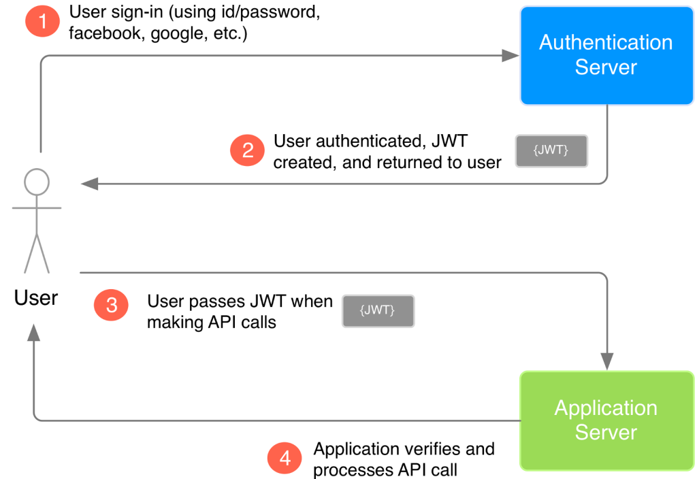
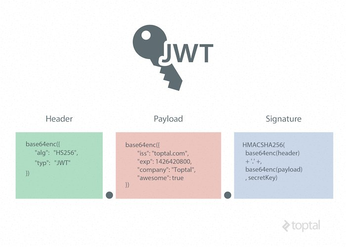

# Reading subjects :

|Subject|
|:--------------------|
|Json Web Token|
|Functional Programming|
|object-oriented programming (OOP)|
|Clases|
|Jest|

*********

# Json Web Token :

JSON Web Token (JWT) is an open standard (RFC 7519) that defines a compact and self-contained way for securely transmitting information between parties as a JSON object. This information can be verified and trusted because it is digitally signed. JWTs can be signed using a secret (with the HMAC algorithm) or a public/private key pair using RSA or ECDSA.

## What Are Tokens?
Now that you understand JSON as a data text format, you may be wondering What are tokens? To put it simply, a token is a string of data that represents something else, such as an identity. In the case of authentication, a non-JWT based token is a string of characters that allow the receiver to validate the sender’s identity. The important distinction here is lack of meaning within the characters themselves. 

## How JWT Works?
JWTs differ from other web tokens in that they contain a set of claims. Claims are used to transmit information between two parties. What these claims are depends on the use case at hand. For example, a claim may assert who issued the token, how long it is valid for, or what permissions the client has been granted.

A JWT is a string made up of three parts, separated by dots (.), and serialized using base64. In the most common serialization format, compact serialization, the JWT looks something like this: xxxxx.yyyyy.zzzzz.

Once decoded, you will get two JSON strings:

1- The header and the payload.
2- The signature. 

##  Why Use JWT?
In short, JWTs are used as a secure way to authenticate users and share information.

Typically, a private key, or secret, is used by the issuer to sign the JWT. The receiver of the JWT will verify the signature to ensure that the token hasn’t been altered after it was signed by the issuer. It is difficult for unauthenticated sources to guess the signing key and attempt to change the claims within the JWT.

Not all signing algorithms are created equal though. For example, some signing algorithms use a secret value that is shared between the issuer and the party that verifies the JWT. Other algorithms use a public and private key. The private key is known only to the issuer, while the public key can be widely distributed. The public key can be used to verify the signature, but only the private key can be used to create the signature. This is more secure than a shared secret because the private key only needs to exist in one place.

Because of this, the server does not need to keep a database with the information needed to identify the user. For developers, this is great news — the server that issues the JWT and the server that validates it do not have to be the same. 

