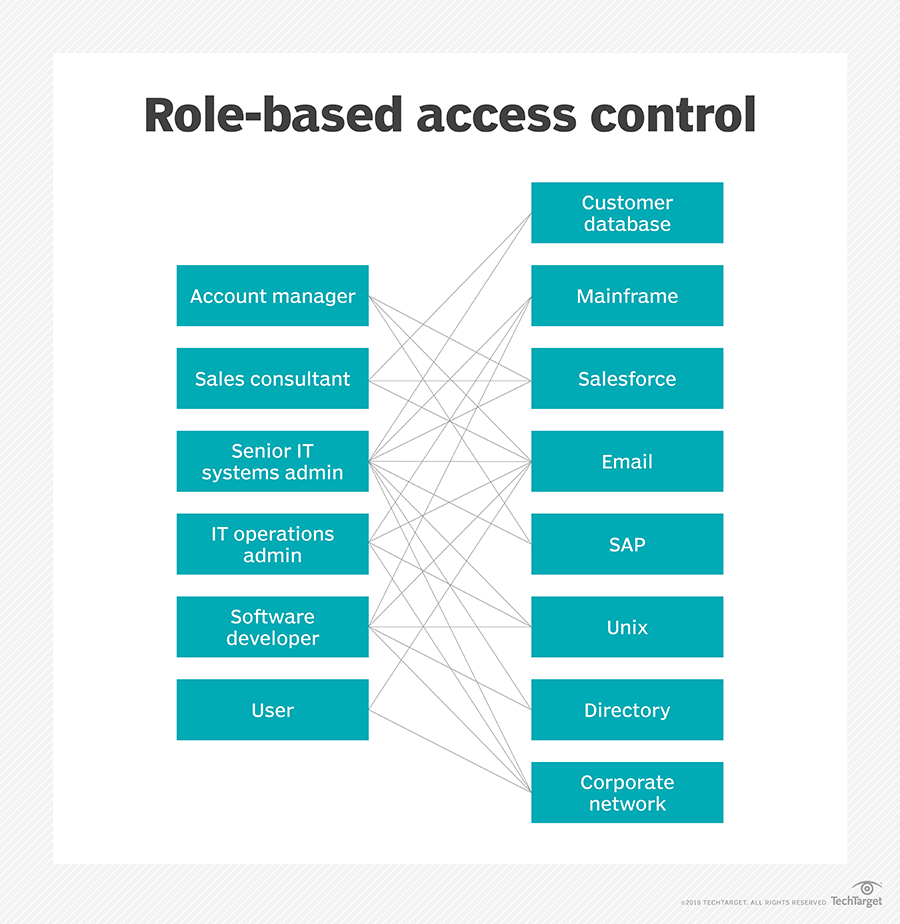

## answer the questions:
1. What header(s) are used in authentication and authorization?

The HTTP Authorization request header can be used to provide credentials that authenticate a user agent with a server, allowing access to a protected resource.

The Authorization header is usually, but not always, sent after the user agent first attempts to request a protected resource without credentials. The server responds with a 401 Unauthorized message that includes at least one WWW-Authenticate header. This header indicates what authentication schemes can be used to access the resource (and any additional information needed by the client to use them). The user-agent should select the most secure authentication scheme that it supports from those offered, prompt the user for their credentials, and then re-request the resource (including the encoded credentials in the Authorization header).

2. What is safe to put into a JWT?
the secret key.

3. How are JWTs validated?

JWT parsing -- The access token string is parsed as a JWT.
Type check -- Checks the "typ" (type) header parameter which indicates the JWT type or usage. The Connect2id server sets it to "at+jwt" for an access token.
Algorithm check -- The JWS algorithm specified in the JWT header is checked whether it matches the agreed / expected one, If a token with an unexpected algorithm is received it is rejected. This prevents downgrade and other attacks that may become possible if tokens with any JOSE algorithm are accepted.
Signature check -- The digital signature is verified by trying an appropriate public key from the server JWK set. The used key is typically identified by the "kid" (key ID) header parameter.
JWT claims check -- The JWT claims set is validated, for example to ensure the token is not expired and matches the expected issuer, audience and other claims.
If any of these checks fails the token is considered invalid and the request must be denied.

*********

# RBAC :
Role-based access control (RBAC) is a method of restricting network access based on the roles of individual users within an enterprise.

RBAC ensures employees access only information they need to do their jobs and prevents them from accessing information that doesn't pertain to them.

## Benefits of RBAC
There are multiple benefits to using RBAC, including:

Improving operational efficiency. With RBAC, companies can decrease the need for paperwork and password changes when they hire new employees or switch the roles of existing employees. RBAC lets organizations quickly add and change roles, as well as implement them across platforms, operating systems (OSes) and applications. It also cuts down on the potential for error when assigning user permissions. Additionally, with RBAC, companies can more easily integrate third-party users into their networks by giving them predefined roles.
Enhancing compliance. Every organization must comply with local, state and federal regulations. Companies generally prefer to implement RBAC systems to meet the regulatory and statutory requirements for confidentiality and privacy because executives and IT departments can more effectively manage how the data is accessed and used. This is particularly important for financial institutions and healthcare companies that manage sensitive data.
Giving administrators increased visibility. RBAC gives network administrators and managers more visibility and oversight into the business, while also guaranteeing authorized users and guests on the system are only given access to what they need to do their jobs.
Reducing costs. By not allowing user access to certain processes and applications, companies may conserve or more cost-effectively use resources, such as network bandwidth, memory and storage.
Decreasing risk of breaches and data leakage. Implementing RBAC means restricting access to sensitive information, thus reducing the potential for data breaches or data leakage.

## Best practices for role-based access control implementations
There are a number of best practices organizations should follow for implementing RBAC, including:

Determine the resources for which companies need to control access, if they're not already listed -- for instance, customer databases, email systems and contact management systems.
Analyze the workforce and establish roles that have the same access needs. However, don't create too many roles because that would defeat the purpose of role-based access control and create user-based access control instead. Some RBAC examples include a basic role that includes the access every employee needs, such as to email and the corporate intranet. Another role could be that of a customer service representative who would have read/write access to the customer database. Another role could be that of a customer database admin with full control of the customer database.
After creating a list of roles and their access rights, align the employees to those roles, and set their access.
Evaluate how roles can be changed, as well as how to close accounts for those leaving the company and how to register new employees.
Ensure RBAC is integrated across all systems throughout the company.
Conduct training so employees understand the principles of RBAC.
Periodicallyconduct audits of the roles, so the employees who are assigned to them and the access that's permitted for each role. If a role is found to have unnecessary access to a certain system, change the role and modify the access level.

************

# User Roles :
The 7 user roles
Primary Owner
The person who creates the account automatically becomes the Primary Owner. They have total control over the account and only they can transfer ownership to another user. Unlike other roles, there can only be one Primary Owner per account.

Owner
Senior managers of your team with responsibility for adding new users, maintaining existing users and billing can be added as owners. Owners have almost full control over the account. An account can have multiple owners.

Admin
Technical administrators have complete control over the files in the account. They can appoint new users and change existing user roles, except Owner roles. They cannot view or manage any billing information. Admins can lock/unlock folders (Enterprise accounts only), making this a powerful role.

Editor
This role gives access to all the day-to-day file management operations (upload, delete, rename, move and copy). Editors are unable to empty the trash, so if files are deleted in error, an Owner or Admin user is able to retrieve them for 30 days. If a folder has been locked, Editors and Contributors cannot delete, rename or overwrite any of its files or subfolders.

Contributor
A limited role, Contributor's can add content to your account - uploading and creating new folders and files. They cannot move, copy, rename or delete any files/folders.

Viewer
A very limited role, Viewer's can only view files and download them.

Billing
Ideal for finance and accounting staff, this role gives complete payment and billing capability, with minimal file capability.

*******

# JSON Web Tokens :

JSON web token (JWT), pronounced "jot", is an open standard (RFC 7519) that defines a compact and self-contained way for securely transmitting information between parties as a JSON object. Again, JWT is a standard, meaning that all JWTs are tokens, but not all tokens are JWTs.

Because of its relatively small size, a JWT can be sent through a URL, through a POST parameter, or inside an HTTP header, and it is transmitted quickly. A JWT contains all the required information about an entity to avoid querying a database more than once. The recipient of a JWT also does not need to call a server to validate the token.

## Benefits
There are benefits to using JWTs when compared to simple web tokens (SWTs) and Security Assertion Markup Language (SAML) tokens.

More compact: JSON is less verbose than XML, so when it is encoded, a JWT is smaller than a SAML token. This makes JWT a good choice to be passed in HTML and HTTP environments.

More secure: JWTs can use a public/private key pair in the form of an X.509 certificate for signing. A JWT can also be symmetrically signed by a shared secret using the HMAC algorithm. And while SAML tokens can use public/private key pairs like JWT, signing XML with XML Digital Signature without introducing obscure security holes is very difficult when compared to the simplicity of signing JSON. Read more about JWT signing algorithms.

More common: JSON parsers are common in most programming languages because they map directly to objects. Conversely, XML doesn't have a natural document-to-object mapping. This makes it easier to work with JWT than SAML assertions.

Easier to process: JWT is used at internet scale. This means that it is easier to process on user's devices, especially mobile.

## Use
JWTs can be used in various ways:

Authentication: When a user successfully logs in using their credentials, an ID token is returned. According to the OpenID Connect (OIDC) specs, an ID token is always a JWT.

Authorization: Once a user is successfully logged in, an application may request to access routes, services, or resources (e.g., APIs) on behalf of that user. To do so, in every request, it must pass an Access Token, which may be in the form of a JWT. Single Sign-on (SSO) widely uses JWT because of the small overhead of the format, and its ability to easily be used across different domains.

Information Exchange: JWTs are a good way of securely transmitting information between parties because they can be signed, which means you can be sure that the senders are who they say they are. Additionally, the structure of a JWT allows you to verify that the content hasn't been tampered with.

## Security
The information contained within the JSON object can be verified and trusted because it is digitally signed. Although JWTs can also be encrypted to provide secrecy between parties, Auth0-issued JWTs are JSON Web Signatures (JWS), meaning they are signed rather than encrypted. As such, we will focus on signed tokens, which can verify the integrity of the claims contained within them, while encrypted tokens hide those claims from other parties.

In general, JWTs can be signed using a secret (with the HMAC algorithm) or a public/private key pair using RSA or ECDSA (although Auth0 supports only HMAC and RSA). When tokens are signed using public/private key pairs, the signature also certifies that only the party holding the private key is the one that signed it.

Before a received JWT is used, it should be properly validated using its signature. Note that a successfully validated token only means that the information contained within the token has not been modified by anyone else. This doesn't mean that others weren't able to see the content, which is stored in plain text. Because of this, you should never store sensitive information inside a JWT and should take other steps to ensure that JWTs are not intercepted, such as by sending JWTs only over HTTPS, following best practices, and using only secure and up-to-date libraries.
