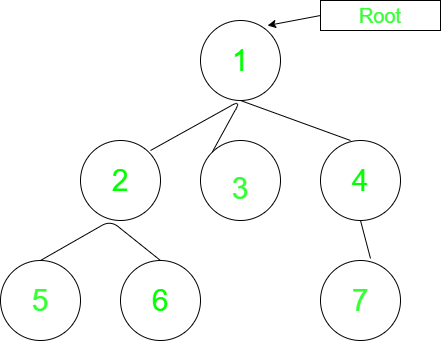
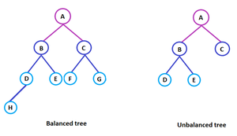

# Trees :

The data structure is a specialized method to organize and store data in the computer to be used more effectively. There are various types of data structures, such as stack, linked list, and queue, arranged in sequential order. For example, a linked data structure consists of a set of nodes that are linked together by links or points.  

Similarly, the tree data structure is a kind of hierarchal data arranged in a tree-like structure. It consists of a central node, structural nodes, and sub nodes, which are connected via edges. We can also say that tree data structure has roots, branches, and leaves connected with one another.  

A tree is non-linear and a hierarchical data structure consisting of a collection of nodes such that each node of the tree stores a value, a list of references to nodes (the “children”).

Recursive Definition: : A tree consists of a root, and zero or more subtrees T1, T2, … , Tk such that there is an edge from the root of the tree to the root of each subtree.

Basic Terminology In Tree Data Structure:

Parent Node: The node which is a predecessor of a node is called the parent node of that node. {2} is the parent node of {6, 7}.
Child Node: The node which is the immediate successor of a node is called the child node of that node. Examples: {6, 7} are the child nodes of {2}.
Root Node: The topmost node of a tree or the node which does not have any parent node is called the root node. {1} is the root node of the tree. A non-empty tree must contain exactly one root node and exactly one path from the root to all other nodes of the tree.
Degree of a Node: The total count of subtrees attached to that node is called the degree of the node. The degree of a leaf node must be 0. The degree of a tree is the maximum degree of a node among all the nodes in the tree. The degree of the node {3} is 3.
Leaf Node or External Node: The nodes which do not have any child nodes are called leaf nodes. {6, 14, 8, 9, 15, 16, 4, 11, 12, 17, 18, 19} are the leaf nodes of the tree.
Ancestor of a Node: Any predecessor nodes on the path of the root to that node are called Ancestors of that node. {1, 2} are the parent nodes of the node {7}
Descendant: Any successor node on the path from the leaf node to that node. {7, 14} are the descendants of the node. {2}.
Sibling: Children of the same parent node are called siblings. {8, 9, 10} are called siblings.
Depth of a node: The count of edges from the root to the node. Depth of node {14} is 3.
Height of a node: The number of edges on the longest path from that node to a leaf. Height of node {3} is 2.
Height of a tree: The height of a tree is the height of the root node i.e the count of edges from the root to the deepest node. The height of the above tree is 3.
Level of a node: The count of edges on the path from the root node to that node. The root node has level 0.
Internal node: A node with at least one child is called Internal Node.
Neighbour of a Node: Parent or child nodes of that node are called neighbors of that node.
Subtree: Any node of the tree along with its descendant
Let’s consider another example of tree data structure.

  

Here,

Node A is the root node

B is the parent of D and E

D and E are the siblings

D, E, and F are the leaf nodes

A and B are the ancestors of E

Few examples on Tree Data Structure: A code to demonstrate few of the above terminologies has been described below:

// C++ program to demonstrate some of the above
// terminologies
#include <bits/stdc++.h>
using namespace std;
// Function to add an edge between vertices x and y
void addEdge(int x, int y, vector<vector<int> >& adj)
{
    adj[x].push_back(y);
    adj[y].push_back(x);
}
// Function to print the parent of each node
void printParents(int node, vector<vector<int> >& adj,
                  int parent)
{
    // current node is Root, thus, has no parent
    if (parent == 0)
        cout << node << "->Root" << endl;
    else
        cout << node << "->" << parent << endl;
    // Using DFS
    for (auto cur : adj[node])
        if (cur != parent)
            printParents(cur, adj, node);
}
// Function to print the children of each node
void printChildren(int Root, vector<vector<int> >& adj)
{
    // Queue for the BFS
    queue<int> q;
    // pushing the root
    q.push(Root);
    // visit array to keep track of nodes that have been
    // visited
    int vis[adj.size()] = { 0 };
    // BFS
    while (!q.empty()) {
        int node = q.front();
        q.pop();
        vis[node] = 1;
        cout << node << "-> ";
        for (auto cur : adj[node])
            if (vis[cur] == 0) {
                cout << cur << " ";
                q.push(cur);
            }
        cout << endl;
    }
}
// Function to print the leaf nodes
void printLeafNodes(int Root, vector<vector<int> >& adj)
{
    // Leaf nodes have only one edge and are not the root
    for (int i = 1; i < adj.size(); i++)
        if (adj[i].size() == 1 && i != Root)
            cout << i << " ";
    cout << endl;
}
// Function to print the degrees of each node
void printDegrees(int Root, vector<vector<int> >& adj)
{
    for (int i = 1; i < adj.size(); i++) {
        cout << i << ": ";
        // Root has no parent, thus, its degree is equal to
        // the edges it is connected to
        if (i == Root)
            cout << adj[i].size() << endl;
        else
            cout << adj[i].size() - 1 << endl;
    }
}
// Driver code
int main()
{
    // Number of nodes
    int N = 7, Root = 1;
    // Adjacency list to store the tree
    vector<vector<int> > adj(N + 1, vector<int>());
    // Creating the tree
    addEdge(1, 2, adj);
    addEdge(1, 3, adj);
    addEdge(1, 4, adj);
    addEdge(2, 5, adj);
    addEdge(2, 6, adj);
    addEdge(4, 7, adj);
    // Printing the parents of each node
    cout << "The parents of each node are:" << endl;
    printParents(Root, adj, 0);
 
    // Printing the children of each node
    cout << "The children of each node are:" << endl;
    printChildren(Root, adj);
 
    // Printing the leaf nodes in the tree
    cout << "The leaf nodes of the tree are:" << endl;
    printLeafNodes(Root, adj);
 
    // Printing the degrees of each node
    cout << "The degrees of each node are:" << endl;
    printDegrees(Root, adj);
 
    return 0;
}
 
 

Output
The parents of each node are:
1->Root
2->1
5->2
6->2
3->1
4->1
7->4
The children of each node are:
1-> 2 3 4 
2-> 5 6 
3-> 
4-> 7 
5-> 
6-> 
7-> 
The leaf nodes of the tree are:
3 5 6 7 
The degrees of each node are:
1: 3
2: 2
3: 0
4: 1
5: 0
6: 0
7: 0
 Types of Tree data structures

The different types of tree data structures are as follows:

1. General tree

A general tree data structure has no restriction on the number of nodes. It means that a parent node can have any number of child nodes.  

2. Binary tree  

A node of a binary tree can have maximum number of two child nodes. In the given tree diagram, node B, D, and F are left children, while E, C, and G are the right children.  

3. Balanced tree

If the height of the left sub-tree and the right sub-tree are equal or differs at most by 1, the tree is known as balanced tree data structure.  

4. Binary search tree

As the name implies, binary search trees are used for various searching and sorting algorithms. The examples include AVL tree and red-black tree. It is a non-linear data structure. It shows that the value of the left node is less than its parent, while the value of right node is greater than its parent.  

Properties

The following are the properties of tree data structures.  

• For the n number of nodes, the edges of a tree are equal to (n – 1). For example, 5 nodes includes (5 – 1) 4 edges in a tree data structure, as shown in the above tree diagram.  

• The arrow in the structure represents the path. Every edge connects two nodes.  

• Any two nodes or vertices of the tree graph are connected by exactly one edge.

• The depth of the node is defined as the length of the path from the root node to the node a. The height of the node ‘a’ is the longest path from the node ‘a’ to the leaf node of the given tree.  

Applications

The applications of tree data structures are as follows:

• Spanning trees

It is the shortest path tree used in the routers to direct the packets to the destination.  

• Binary Search Tree

It is a type of tree data structure that helps in maintaining a sorted stream of data.  

• Storing hierarchical data

Tree data structures are used to store the hierarchical data, which means data arranged in the form of order.  

• Syntax tree

The syntax tree represents the structure of the program’s source code, which is used in compilers.  

• Trie

It is the fast and efficient way for dynamic spell checking. It is also used for locating specific keys from within a set.  

• Heap

It is also a tree data structure that can be represented in a form of array. It is used to implement priority queues.  