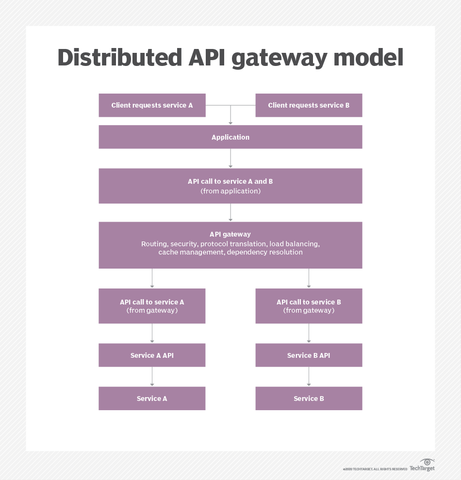

# AWS API gateway :

What is Amazon API Gateway?
Amazon API Gateway is an Amazon Web Services (AWS) feature that enables developers to connect non-AWS applications to AWS back-end resources, such as servers and code. The gateway increases AWS customers' access to compatible applications and the overall utility of Amazon's other cloud services.

An application program interface (API) allows software programs to communicate, making them more functional. An AWS user creates, manages and maintains APIs within the Amazon API Gateway.

An API gateway accepts and processes concurrent API calls, which happen when APIs submit requests to a server. It manages traffic, authorizes end users and monitors performance. Using Amazon API Gateway, a developer can connect with services such as:

AWS Elastic Beanstalk;
Elastic Compute Cloud instances;
AWS Lambda event-driven code; and
AWS Step Functions state machines.

*****

## How does Amazon API Gateway work?
A developer creating an API must define the following four aspects:

its name;
an HTTP function;
how the API integrates with services; and
how requests and transfers are handled.
The developer then uses a software development kit (SDK), including custom ones for mobile and web apps, to integrate with software that calls the APIs.

Amazon API Gateway accepts all payloads sent over HTTP, including JavaScript Object Notation and Extensible Markup Language. AWS users can monitor the API calls on a metrics dashboard in Amazon API Gateway. They also can retrieve error, access and debug logs from Amazon CloudWatch.

Amazon API Gateway provides two ways of handling API call traffic:

Throttling: API throttling limits the number of API calls per hour or per day. Throttling helps maintain the performance of calling applications during unexpected spike in API calls. Spikes can happen when many users use an application at the same time.
Caching: Many API calls use the same information and return the same result. Caching provides common API responses rather than performing all the processing required to produce a result. Caching reduces the number of API calls and improves the performance of calling applications.
Amazon API Gateway provides security using access keys to control API access. It works with AWS Identity and Access Management and Amazon Cognito to authorize access to APIs. The service also supports AWS Signature Version 4 as another security option; creating access keys for each API call. OAuth tokens can also be passed to running workloads as an alternative security measure.

The gateway service lets developers using AWS operate multiple versions of an API simultaneously. That way, they can build and deploy new APIs while existing applications use previous versions.

Amazon API management components
API management platforms support the API infrastructure and its underlying data. They incorporate several components in a layered architecture, including gateways. Other API management components include:

API developer portal. An API developer portal lets developers access documentation and other information related to an API in one place. The portal contains resources and tools, such as SDK, forums and API keys. It helps API developers build, test and run the API.

Reporting and analytics. Tracking usage metrics is a critical part of API management. Usage metrics include data such as requests per second, request volume, latency and throughput.

This data helps organizations measure how their API programs are performing.

API lifecycle management. The API lifecycle describe the steps in the development and maintenance of an API. It is a process that begins with the design of the API and continues with the development, testing and deployment. The lifecycle ends with the retirement of the API. Various tools and best practices can help with API lifecycle managementS 
   

