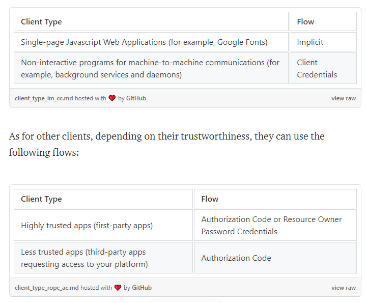

Background
Many authorization processes involve credentials provided by the user, most commonly in the form of username/password combination. Early websites usually ask for credentials via an HTML form, which the browser will send to the server. The server authenticates the information and writes a session value in the cookie; as long as the session is still marked active, user can access protected features and resources. Thanks to its simplicity and effectiveness, this process is still used by many web applications and services at the present day.

Popular as it might be, cookie-based authorization has several drawbacks:

Cookie-based authorization are usually stateful. The server has to keep a record of active sessions and check with the database every time a request arrives, which requires some overhead on the server-side. It is also difficult to decouple the authorization process from the application server.
Cookies are usually bundled with domains. If your application interacts with multiple domains, additional configuration may be required.
Cookie-based authorization does not play well with mobile clients.
Cookie-based authorization does not accommodate well the use case where users of one product or service would like to grant third-party clients access to their information on the platform.
OAuth addresses these concerns. As an authorization framework enabling applications to access resources from all kinds of services, it is widely used on the web. Currently OAuth has two versions of protocols, OAuth 1.0 (RFC 5849) and OAuth 2.0 (RFC 6749). This guide focuses on the 2.0 version. Essentially, OAuth 2.0 allows arbitrary clients (for example, a first-party iOS application or a third-party web application) to access user’s (resource owner’s) resources on resource servers via authorization servers in a secure, reliable, and efficient manner.

 4 types of authorization flows:

Authorization Code
Resource Owner Password Credentials
Implicit
Client Credentials
Implicit and Client Credentials are flows typically reserved for special types of clients. More specifically,

Loosely speaking, if you plan to build a platform where third-party applications and services can access its resources, go with the authorization code flow; on the other hand, you can use the resource owner password credentials flow to build a client (a web/mobile application) for your own service.

Tokens play an important part in OAuth 2.0. There are two types of tokens: access tokens and refresh tokens. Anyone with a valid access token can access protected resources; usually it is short-lived so that even if there is a security breach and the access token is leaked, the damage can be quickly controlled. When an access token expires, developers can use an optional refresh token to request a new access token without having to ask the user to enter their credentials again.

Authorization Flows
Resource Owner Password Credentials
Resource Owner Password Credentials flow has the following requirements:

The client must be highly trusted, as it directly handles user credentials. In most cases, the client should be a first-party app.
The flow includes the following steps:

The client prompts user to enter their credentials (for instance, a username/password combination).
The client sends the credentials and its own identification to the authorization server. The authorization server validates the information, then returns an access token and optionally a refresh token.
The client uses the access token to access resources on the resource server.

Authorization Code
Authorization Code flow has the following requirements:

The client must be able to interact with an user agent (browser) in the environment.
The flow includes the following steps:

The client prepares a link to the authorization server and opens the link for user in an user agent (browser). The link includes information that allows the authorization server to identify and respond to the client.
User enters their credentials on the new page.
Credentials are sent to authorization server via the user agent (browser).
The authorization server validates the credentials and redirects user back to the client with an authorization code.
The client talks with the authorization server, confirms its identify and exchanges the authorization code for an access token and optionally a refresh token.
The client uses the access token to access resources on the resource server.
Note that due to security concerns, even though both mobile app clients and web app clients can use the authorization code flow, their approaches to identify themselves in the flow are different. Web app clients usually use client IDs and client secrets, while mobile app clients need to adopt the Proof Key for Code Exchange (PKCE) technique and utilize code challenges and code verifiers.

Implicit and Client Credentials
Implicit flow, as said earlier, is designed for single-page Javascript apps. This flow is vastly similar to the Authorization Code flow, except for the part involving authorization code. Due to security concerns, in this flow the client no longer receives an authorization code from the authorization server; instead, after the user agent successfully transfers credentials, the authorization server returns access tokens directly to the client. Refresh tokens are not allowed in the Implicit flow.

Client Credentials flow, on the other hand, is closer to the Resource Owner Password Credentials flow. Clients in this flow use client IDs and secrets to identify themselves, and exchange them for access tokens with the authorization server. You should not use refresh tokens in this flow either.

JWT (JSON Web Tokens)
You may have realized that even though tokens are frequently referenced in OAuth 2.0, so far few has been said about their generation and usage. The truth is, OAuth 2.0 framework does not specify what format access tokens and refresh tokens should take and it is up to developers themselves to integrate tokens in the their choice of authorization flows. Theoretically speaking, you may very well use a predefined string that never expires as the access token, even though it is obviously not very secure; in reality, however, many developers choose to use the JWT (JSON Web Token) format. JWT is self-contained, allowing servers to validate tokens without having to inquire a data source.

A JWT includes three parts:

A header describing the type of the token and the hashing algorithm it uses
A payload containing the data
A signature for verifying the token
All the three parts should be Base64URL encoded so that they can be safely transferred in a query string.

You can use many hashing algorithms with JWT and the payload has a variety of pre-defined fields (also known as registered claim names). This Beginner’s Guide uses the RS256(RSA Signature with SHA-256) algorithm and specifies two registered claims in the payload: exp(when does the token expire), and iss(who issues the token). Aside from the supported claims, you can also define your own claims in the payload, such as the scopes of the token.

Every time a JWT arrives at a server, the system first parses the JWT, and verifies if the algorithm specified in the header is supported; then it checks the signature to make sure that the JWT is valid, and at last, confirms that registered claims (if exist) are valid. In the case of this guide, it means making sure that the JWT hasn’t expired (exp), and comes from an expected origin (iss). Custom claims, such as scopes, can be extracted from the token and manually validated.

Expiration Date and Refresh Token
Additionally, developers have control over the lifespan of access tokens and the usage of refresh tokens. Generally speaking, if you are building an authorization server protecting critical resources, it might be better to stay away from refresh tokens and keep access tokens short-lived. For less critical resources though, it is OK to enable refresh tokens and let the access tokens live a little bit longer. Resist the temptation to create evergreen tokens though; long-lived access tokens do make development easier, however there is always a trade-off between security and convenience.